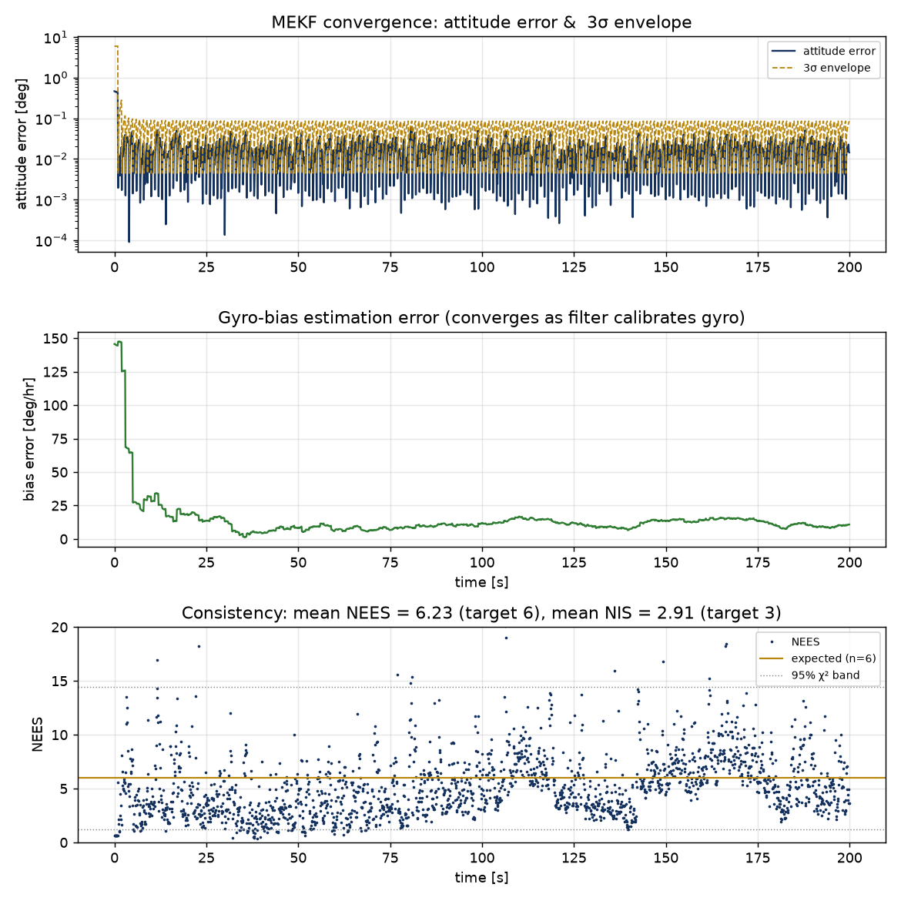
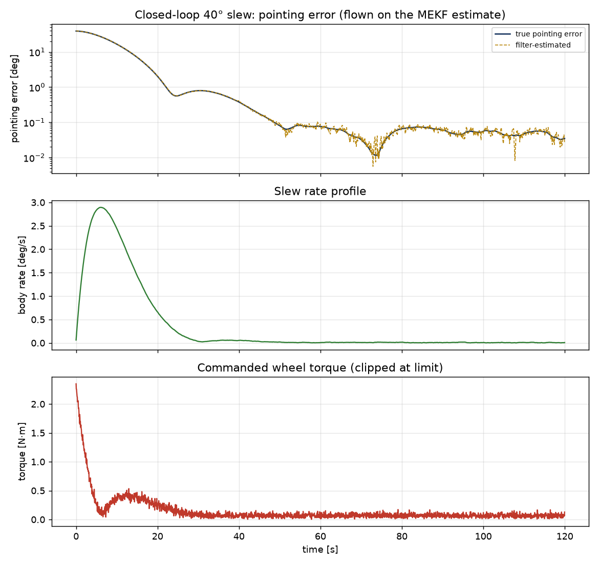

# Spacecraft Attitude Determination & Control (MEKF)

A from-scratch Python implementation of spacecraft attitude estimation and control,
centered on a **Multiplicative Extended Kalman Filter (MEKF)** that estimates both
attitude and gyro bias by fusing a rate gyro with a star tracker. Every module is
built directly from first-principles derivations (quaternions and rigid-body
dynamics through the error-state MEKF and quaternion feedback control).

This is the attitude counterpart to an orbit-determination filter: it closes the
Guidance-Navigation-Control loop with rigorous **filter consistency validation**
(NEES / NIS) — the piece that turns "a filter that runs" into "a filter you can
prove works."

> **Companion project:** [orbit-determination-ekf](https://github.com/henshs/orbit-determination-ekf)
> — the translational half of the same GNC problem: spacecraft orbit determination
> from noisy ground-station tracking using an Extended Kalman Filter.

## Highlights

- **Quaternion** algebra, DCM & Euler-angle conversions, singularity-free kinematics
- **Rigid-body dynamics** — Euler's equation, inertia tensor, energy/momentum-conserving propagation
- **Static determination** — TRIAD (deterministic) and Davenport q-method / QUEST (optimal, Wahba)
- **Gyro model** with drifting bias (ARW + RRW) and **star-tracker** attitude measurement
- **Multiplicative EKF** — error-state formulation, bias estimation, Joseph-form covariance
- **NEES / NIS** consistency diagnostics with χ² confidence bounds
- **Attitude control** — quaternion feedback PD (with gyroscopic feedforward) and **LQR**
- Unit tests including energy/momentum conservation and quaternion round-trips

## Layout

```
src/
  attitude/
    quaternion.py      quaternion algebra, DCM, axis-angle, small-angle error
    kinematics.py      q_dot = 1/2 q (x) omega, exact propagation
    frames.py          Euler 3-2-1 <-> DCM/quaternion
  dynamics/
    rigid_body.py      Euler's equation, coupled attitude propagation
  determination/
    triad.py           deterministic two-vector attitude
    quest.py           Davenport q-method (optimal Wahba solution)
  sensors/
    gyro.py            rate gyro: omega + bias + noise (ARW/RRW)
    star_tracker.py    noisy full-attitude quaternion
  filters/
    mekf.py            Multiplicative EKF (attitude + bias)
    consistency.py     NEES, NIS, chi2 bounds
  control/
    attitude_control.py  quaternion PD + LQR
examples/
  mekf_attitude_estimation.py   CAPSTONE 1: estimation + consistency plots
  closed_loop_adcs.py           CAPSTONE 2: full sense->estimate->control->actuate loop
tests/
  test_all.py
```

## Quick start

```bash
pip install -r requirements.txt

python examples/mekf_attitude_estimation.py   # MEKF demo + NEES/NIS plots
python examples/closed_loop_adcs.py           # closed-loop 40-degree slew
python tests/test_all.py                       # or: pytest -q
```

## What the capstones show

**`mekf_attitude_estimation.py`** — a slowly rotating spacecraft with a drifting
gyro bias, tracked by fusing noisy gyro rates with periodic star-tracker fixes.



Attitude error converges to ~0.01° inside its 3σ envelope, gyro-bias error collapses
from ~150°/hr to ~10°/hr as the filter calibrates the gyro, and NEES scatters around
6 inside the χ² band — **mean NEES ≈ 6, mean NIS ≈ 3**, a statistically consistent filter.

**`closed_loop_adcs.py`** — the full ADCS loop: gyro + star tracker feed the MEKF;
the MEKF estimate drives a quaternion-PD controller; the torque is integrated through
the true rigid-body dynamics.



A 40° slew flown entirely on the *filter's estimate* (as in flight), settling to ~0.1° pointing.

## Convention

Scalar-first quaternions `q = [w, x, y, z]`, unit norm, representing the
inertial→body rotation (`v_body = dcm(q) @ v_inertial`). The MEKF uses a
body-frame (local) multiplicative error `q_true = q_ref (x) dq`, with the
6-D error state `[dtheta; dbias]`. Units: SI (rad, s, kg·m²).

## Validation

`tests/test_all.py` (10 tests): quaternion conjugate-inverse, DCM↔quaternion
round-trip, proper-rotation check, Euler round-trip, single-axis propagation,
energy & inertial-momentum conservation under torque-free tumble, TRIAD exactness,
QUEST attitude recovery, small-angle error extraction, and LQR closed-loop
stability.

## Acknowledgments

The derivations, code, and validation were developed by the author in
collaboration with **Claude** (Anthropic), used as a technical sounding board for
the underlying mathematics and implementation structure. All results were
independently checked (unit tests, conservation laws, and NEES/NIS consistency).

## License

MIT. See [LICENSE](LICENSE.txt) for details.
